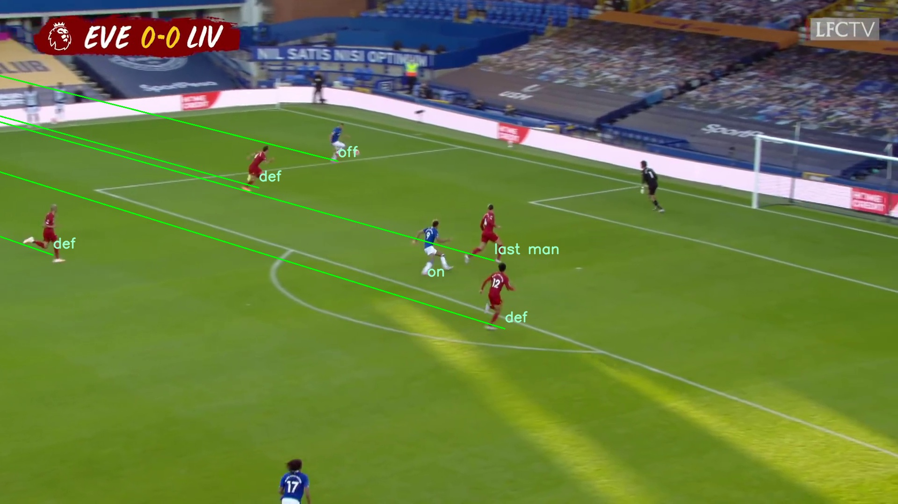

# Phát hiện việt vị trong bóng đá sử dụng Thị giác máy tính

- [Phát hiện việt vị trong bóng đá sử dụng Thị giác máy tính](#phát-hiện-việt-vị-trong-bóng-đá-sử-dụng-thị-giác-máy-tính)
  - [Thành viên nhóm:](#thành-viên-nhóm)
  - [Mô tả:](#mô-tả)
  - [Giải thuật](#giải-thuật)
  - [Google Colab](#google-colab)
  - [Run](#run)
  - [Tài liệu tham khảo:](#tài-liệu-tham-khảo)
## Thành viên nhóm:
|STT|Tên|MSSV|
|---|---|---|
| 1  |Đoàn Thế Lên|106200233|
| 2  |Lê Minh Nhật|106200238|
| 3  |Huỳnh Nhật Ánh|106200252|

## Mô tả:
Phát hiện việt vị là một phần quan trọng trong mỗi trận đấu bóng đá, nhưng việc ra quyết định vẫn gặp nhiều thách thức ngay cả khi đã có sự hỗ trợ của Trợ lý Trọng tài Video (VAR). Công nghệ Thị giác Máy tính mở ra một hướng tiếp cận mới đầy tiềm năng để tự động hóa quá trình này, giảm thiểu lỗi do con người và rút ngắn thời gian chờ đợi. Tuy nhiên, vẫn còn khó khăn trong việc thiết lập các giải thuật toàn diện, phương pháp tính toán chính xác cho các cảnh và tập dữ liệu đa dạng để kiểm tra là những trở ngại lớn. Đề tài này tập trung vào việc phát triển và đánh giá thuật toán quyết định việt vị dựa trên Thị giác Máy tính, đồng thời cung cấp một tập dữ liệu mới và phương pháp tiếp cận định lượng nhằm thúc đẩy nghiên cứu trong lĩnh vực này.


*Hình 1. Có thể nhận thấy trong trận đấu, cầu thủ đang tấn công (áo xanh) đang phạm lỗi việt vị*

## Giải thuật


1. Tìm điểm biến mất(Vanishing point) dựa vào vạch giữa sân và ranh giới khu vực phạt đền
2. Phát hiện các cầu thủ trong sân và các điểm bộ phận cơ thể
3. Xác định đội của các cầu thử dựa vào xử lý ảnh


*Hình 2. Phân loại các cầu thủ trong sân với 0 là team A và 1 là team B*


4. Vẽ hình chiếu của bộ phận xa nhất của các cầu thủ và kết nối với các điểm biến mất ngang (Horizontal vanishing point)
5. Phát hiện việt vị dựa vào so sánh góc của cầu thủ phòng ngự cuối cùng và cầu thủ tấn công


*Các cầu thủ tấn công được gán nhãn ON hoặc OFF với OFF là cầu thủ đang phạm lỗi việt vị Cầu thủ phòng ngự cuối được gán nhãn last man*
## Google Colab
[](https://colab.research.google.com/drive/1SR3bBqcDnYhNZ_dszJZDorJxyBIrSl0C?usp=sharing)

## Run
1. Sử dụng môi trường Conda để cài đặt các package cần thiết.

    ```conda env create -f environment. yml```

2. Chạy file  ```main.py```. Kết quả đầu ra xuất hiện trong folder hình ảnh kết quả.

    ``` python3 main.py ```


## Tài liệu tham khảo:
[A Dataset & Methodology for Computer Vision based Offside Detection in Soccer](https://dl.acm.org/doi/10.1145/3422844.3423055)
[Dataset](https://drive.google.com/drive/folders/1TgxT-9GRB3BWice_5WHuCQ4Byev-NHFI?usp=sharing)
[Models](https://drive.google.com/drive/folders/1DW0G-zgLs3g_rf3QnWQGjQ7euCJPaOs3?usp=sharing)